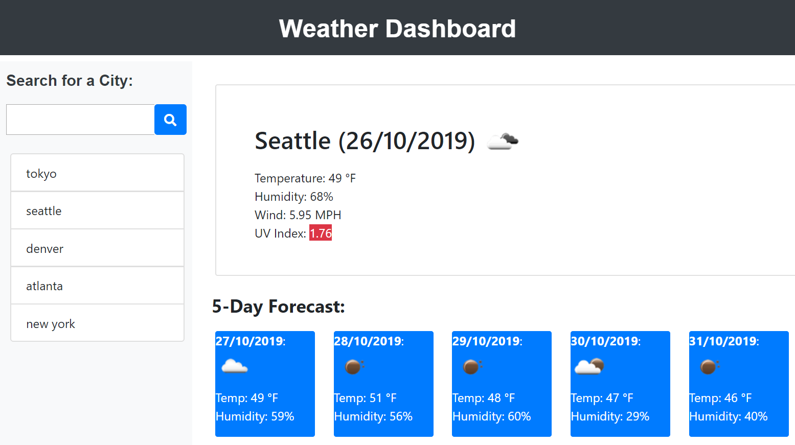

# Unit 06 Third-Party APIs Homework: Weather Dashboard

Name:
Weather Dashboard

Description:
Building a weather dashboard application with search functionality to find current weather conditions and the future weather outlook for multiple cities. 

The app should display standard business hours (9 a.m. to 5 p.m.). Each time slot should represent one hour and contain the following:

Use the OpenWeather API to retrieve weather data for cities. The documentation includes a section called "How to start" that will provide basic setup and usage instructions.
Use AJAX to hook into the API to retrieve data in JSON format.
Your app will run in the browser and feature dynamically updated HTML and CSS powered by jQuery.

Display the following under current weather conditions:

City
Date
Icon image (visual representation of weather conditions)
Temperature
Humidity
Wind speed
UV index

Include a search history so that users can access their past search terms. Clicking on the city name should perform a new search that returns current and future conditions for that city. 

Include a 5-Day Forecast below the current weather conditions. Each day for the 5-Day Forecast should display the following:

Date
Icon image (visual representation of weather conditions)
Temperature
Humidity

 Screenshots:

 
  

Installation:

This webpage is available as my github page whose link is https://saranyav91.github.io//weather_dashboard

Usage:

This is, as mentioned earlier, a weather dashboard web application. Also, this webpage can be accessed from different devices of varied resolutions, without any issue in the page outlook and navigation.

Support:

Contact me, Saranya Vasudevan at sara.29891@gmail.com

